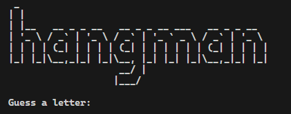
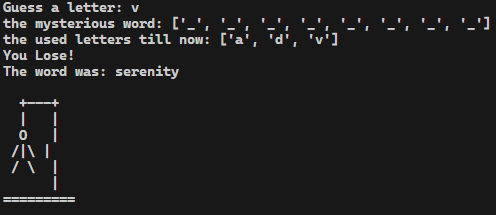

# Hangman Game

## Rules

1. **Objective:** Guess the hidden word before the hangman is fully drawn.
2. **How to Play:**
   - A random word is selected, and the number of letters is displayed as underscores.
   - You can guess one letter at a time.
   - If the guessed letter is in the word, it is revealed; otherwise, a part of the hangman is drawn.
   - Repeat until the word is guessed or the hangman is complete.
3. **Winning:** Guess the entire word before the hangman is fully drawn.
4. **Losing:** The hangman is completed before you guess the word.

### Start

### Game Over

Good luck!
