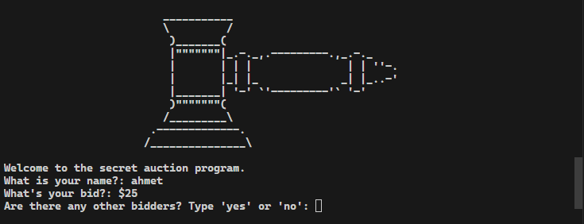
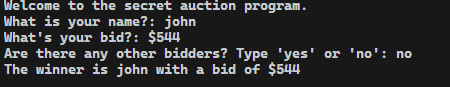

# Secret Auction Program

## Overview

A Python program that facilitates a secret auction where participants can anonymously bid for an item. The program determines the highest bidder at the end of the auction.

## How to Play

1. **Start the Program:**
   - Run the Python script in your terminal or preferred Python environment.
   - The program will display a welcome message and prompt for your name and initial bid.

2. **Place Your Bid:**
   - Enter your name when prompted.
   - Enter the amount you want to bid.

3. **Continue Bidding:**
   - If there are more bidders, the program will clear the console and prompt the next participant.
   - Repeat the process until there are no more bidders.

4. **Determine the Winner:**
   - Once all bids are placed, the program will announce the winner with the highest bid.

## How It Works

- The program maintains a dictionary of bidders with their corresponding bid amounts.
- After the bidding concludes, it finds the highest bidder and displays the winner.

## Screenshots

### Bidding in Progress

### Winner Announced

## Running the Program

1. Ensure you have Python installed on your system.
2. Download the script [`secret_auction.py`](secret_auction.py).
3. Open your terminal or command prompt.
4. Navigate to the directory where the script is located.
5. Run the script using the command: `python secret_auction.py`.

## Note

- The program uses the `os` module to clear the console. If you encounter issues with clearing the console, make sure your terminal supports the command (`cls` for Windows, `clear` for Unix-like systems).
- For the best experience, run the script in a terminal outside of integrated development environments (IDEs) like VS Code.

Good luck with your secret auction!
